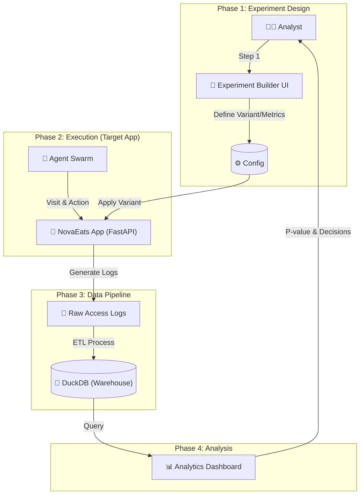

# NovaRium Edu: End-to-End A/B Testing Simulator for Data Analysts

<div align="center">
  <h3>🎓 데이터 분석가를 위한 실전 A/B 테스트 & 데이터 마트 구축 프로젝트</h3>
  <p>이론을 넘어 <b>실험 설계부터 데이터 파이프라인(ETL), 분석, 의사결정</b>까지<br>전 과정을 직접 시뮬레이션하며 구축한 개인 포트폴리오 프로젝트입니다.</p>
</div>

---

## 🧐 프로젝트 배경 (Why Project?)

### "실무 경험의 닭과 달걀 문제를 해결하다"
데이터 분석가를 준비하며 가장 큰 어려움은 **'실제 트래픽 기반의 A/B 테스트 경험'**을 쌓기 어렵다는 점이었습니다. 
이론만으로는 **실험 설계의 난관(Traffic Split, Sample Size)**, **데이터 정합성 문제**, **지표 설정의 모호함**을 체감하기 어렵다고 판단했습니다.

따라서 직접 **가상 쇼핑몰(Target App)**과 **유저 시뮬레이터(Agent Swarm)**를 구축하고, 그 위에서 분석가가 수행해야 할 전체 라이프사이클을 경험할 수 있는 **통합 시뮬레이션 환경**을 개발했습니다.

## 🎯 핵심 역량 및 기능 (Key Capabilities)

이 프로젝트를 통해 다음과 같은 **데이터 분석가 핵심 역량**을 실제 코드로 구현했습니다.

### 1. 실험 설계 및 관리 (Experiment Design & Management)
> *Demonstrated Skill: Experimental Design, Hypothesis Testing, Power Analysis*

- **Visual Experiment Builder**: 코딩 없이 직관적으로 대조군(Control)과 실험군(Test)을 설정하고 미리보기(Preview)를 제공합니다.
- **Robust Metrics Framework**:
    - **OEC (Overall Evaluation Criterion)**: 핵심 지표(Primary)와 목표 상승폭(MDE) 설정.
    - **Guardrails**: 매출 하락 등 부작용을 방지하기 위한 안전 장치(Safety Margin) 설정.
- **Statistical Power Analysis**: `scipy`를 활용해 Alpha(유의수준), Power(검정력), Baseline CTR에 따른 **필요 표본 수(Sample Size)**를 자동 계산합니다.

### 2. 데이터 엔지니어링 및 파이프라인 (Data Engineering)
> *Demonstrated Skill: ETL, SQL, Data Warehouse Modeling*

- **DuckDB 기반 DW 구축**: 로컬 OLAP 데이터베이스인 DuckDB를 활용해 Serverless 데이터 웨어하우스를 구축했습니다.
- **Log to Mart 파이프라인**:
    - **Raw Data**: 유저 로그(Events), 주문 정보(Orders) 적재.
    - **Data Mart**: 분석하기 쉬운 형태(`daily_metrics`, `user_stats`)로 가공하는 배치(Batch) 작업 자동화.

### 3. 유저 행동 시뮬레이션 (User Simulation)
> *Demonstrated Skill: Data Generation, Behavioral Analysis*

- **Agent Swarm**: 단순 난수 생성이 아닌, **5가지 페르소나(충동형, 신중형, 체리피커 등)**를 가진 AI 에이전트가 확률 모델에 따라 행동합니다.
- **Dynamic Interaction**: 실험 변인(예: 배너 색상 변경, 할인율 증가)에 따라 에이전트의 클릭률(CTR)과 구매율(CVR)이 동적으로 변화하도록 모델링했습니다.

---

## 🏗️ 시스템 아키텍처 (Architecture)

**User Flow**부터 **Data Flow**까지의 전체 흐름입니다.



## 🛠️ 기술 스택 (Tech Stack)

분석 환경과 동일한 **Python 생태계**를 기반으로 구축했습니다.

| Category | Tech Stack | Usage |
|----------|------------|-------|
| **Analysis** | **DuckDB** | 고성능 로컬 OLAP 분석 및 데이터 저장소 |
| **Logic** | **Statsmodels / Scipy** | T-test, Power Analysis 등 통계 검정 엔진 |
| **Visual** | **Streamlit** | 인터랙티브 대시보드 및 실험 설계 도구 |
| **App** | **FastAPI** | 실험 대상 서비스(Target App) 백엔드 구현 |
| **Viz** | **Plotly** | 시계열 데이터 및 분포 시각화 |

## 🚀 실행 방법 (How to Run)

누구나 로컬 환경에서 이 분석 시뮬레이터를 실행해볼 수 있습니다.

### 1. 설치 (Installation)

```bash
# Clone Repository
git clone https://github.com/1916571-alt/NovaRium-MVP.git

# Install Dependencies
pip install -r requirements.txt
```

### 2. 실행 (Run Simulator)

```bash
# Streamlit 대시보드 실행 (Main Entrypoint)
streamlit run src/app.py
```

브라우저에서 `localhost:8501`이 열리면 **"실험 설계 (Experiment Builder)"** 탭으로 이동하여 나만의 A/B 테스트를 시작해보세요.

---

## 📂 프로젝트 구조 (Structure)

```
NovaRium-MVP/
├── src/
│   ├── app.py             # 메인 애플리케이션 (Entrypoint)
│   ├── core/              # 핵심 비즈니스 로직
│   │   ├── stats.py       # 통계 검정 및 표본 계산 엔진
│   │   └── simulation.py  # 유저 행동 시뮬레이터
│   ├── data/              # 데이터베이스 및 쿼리 관리
│   └── ui/                # Streamlit UI 컴포넌트
├── target_app/            # 실험 대상 웹 애플리케이션 (FastAPI)
├── docs/                  # PRD 및 기획 문서
└── README.md              # 프로젝트 문서
```

---
<div align="center">
  <p>Developed with ❤️ by <b>Geonyul Shin</b></p>
  <p><i>Building Bridges Between Theory and Practice.</i></p>
</div>
