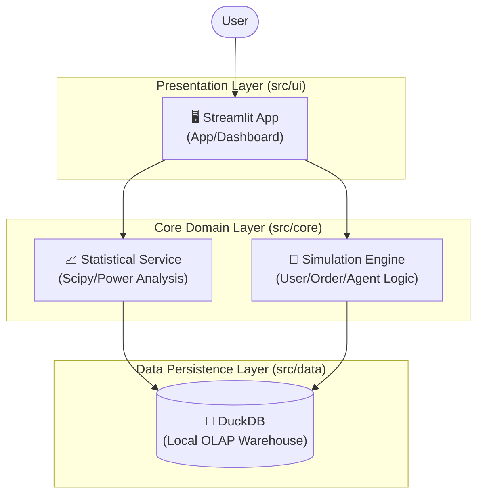

# NovaRium Edu: 실전 A/B 테스팅 마스터 클래스

<div align="center">
  <h3>🎓 미래의 데이터 분석가를 위한 인터랙티브 A/B 테스트 시뮬레이터</h3>
  <p>이론이 아닌 <b>실전 시뮬레이션</b>을 통해 실험의 전체 과정을 마스터하세요.</p>
</div>

---

## 📖 소개 (Introduction)

**NovaRium Edu**는 이론적인 A/B 테스트 지식과 실무 적용 사이의 간극을 메우기 위해 설계된 교육용 플랫폼입니다.
단순히 통계 공식을 외우는 것을 넘어, **가설 설정(Plan)부터 실험 설계(Design), 데이터 수집(Collect), 분석(Analyze)**에 이르는 전체 사이클을 직접 경험할 수 있습니다.

본 프로젝트는 **'모던 소프트웨어 엔지니어링'** 원칙을 준수하여 개발되었으며, 사용자에게는 분석적 사고를, 개발자에게는 공학적 설계의 모범 사례를 제공하는 것을 목표로 합니다.

## 🌟 핵심 기능 (Key Features)

### 1. 5단계 마스터 클래스 (Wizard Mode)
분석가의 실제 업무 흐름을 그대로 따라가는 마법사 모드를 제공합니다:
- **1단계: 가설 및 지표**: OEC(주요 지표)와 가드레일 지표를 정의하고 가설을 수립합니다.
- **2단계: 파워 분석**: `scipy`를 활용해 검정력(Power)과 유의수준(Alpha)에 기반한 필요 표본 크기를 계산합니다.
- **3단계: 샘플링**: 해시(Hash) 알고리즘을 이용한 결정론적 트래픽 분배 과정을 시각화합니다.
- **4단계: 시뮬레이션**: AI 페르소나(Agent Swarm)를 투입하여 실제와 유사한 유저 행동 데이터를 생성합니다.
- **5단계: 분석**: DuckDB SQL을 실행하여 결과를 집계하고 P-value를 통해 승패를 판정합니다.

### 2. 에이전트 스웜 (Agent Swarm)
난수로 생성된 단순 더미 데이터가 아닙니다. '충동형', '신중형', '목적형' 등 5가지 성향을 가진 **AI 에이전트**들이 가상 쇼핑몰을 이용하며 남긴 행동 데이터를 분석합니다.

### 3. 실험 회고록 (Retrospective)
모든 실험 결과는 자동으로 아카이빙됩니다. 성공한 실험과 실패한 실험을 기록하고 복기하며 자신만의 **데이터 분석 포트폴리오**를 완성할 수 있습니다.

## 🏗️ 시스템 아키텍처 (System Architecture)

이 프로젝트는 **클린 아키텍처(Clean Architecture)** 및 계층형 구조를 따릅니다:



## 💻 기술적 우수성 (Engineering Excellence)

- **TDD (테스트 주도 개발)**: 핵심 비즈니스 로직(통계, 데이터 생성)은 `pytest` 기반의 단위 테스트로 검증되었습니다.
- **모듈화 설꼐 (Modularity)**: 관심사 분리(SoC) 원칙에 따라 UI, Core, Data 계층이 명확히 분리된 `src` 패키지 구조를 갖습니다.
- **로컬 데이터 웨어하우스**: **DuckDB**를 도입하여 별도의 서버 구축 없이도 대용량 데이터에 대한 고성능 분석이 가능합니다.

## 🛠️ 기술 스택 (Tech Stack)

- **Frontend**: Streamlit, Plotly
- **Core Logic**: Python 3.9+, Scipy, NumPy, Faker
- **Database**: DuckDB
- **Testing**: Pytest

## 🚀 시작하기 (Quick Start)

### 1. 설치 (Installation)

```bash
# 저장소 복제
git clone https://github.com/1916571-alt/NovaRium-MVP.git

# 가상환경 생성 (권장)
python -m venv venv
# Windows
.\venv\Scripts\activate
# Mac/Linux
source venv/bin/activate

# 의존성 패키지 설치
pip install -r requirements.txt
```

### 2. 앱 실행 (Run Application)

```bash
# 대시보드 실행 (새로운 진입점)
streamlit run src/app.py
```

## 📄 라이선스 (License)

MIT License

---
<div align="center">
  <p>Developed by <b>Geonyul Shin</b></p>
</div>
