# NovaRium Edu: A/B Testing Master Class

<div align="center">
  <h3>🎓 Interactive A/B Testing Simulator for Future Data Analysts</h3>
  <p>Learn the complete experimentation workflow through hands-on simulation.</p>
</div>

---

## 📖 Introduction

**NovaRium Edu** is an educational platform designed to bridge the gap between theoretical A/B testing knowledge and practical application. While many courses focus on statistical formulas, they often lack the context of the full experimentation lifecycle.

This project offers a **"Wizard Mode"** that guides users through the entire process—from hypothesis generation to rigorous statistical analysis—simulating real-world traffic and user behaviors using advanced **Agent Swarm** technology.

## 🌟 Key Features

### 1. 5-Step Master Class (Wizard Mode)
Experience the end-to-end workflow of a data analyst:
- **Hypothesis & Metrics**: Define OEC (Overall Evaluation Criterion) and Guardrail metrics.
- **Power Analysis**: Calculate sample size using `scipy` based on Alpha, Power, and MDE.
- **Sampling**: Visualize deterministic traffic allocation using Hash algorithms.
- **Simulation**: Run realistic experiments with AI personas.
- **Analysis**: Perform SQL-based aggregation and statistical validation.

### 2. Agent Swarm Simulation
Instead of random data generation, NovaRium uses **5 distinct AI Agent Personas** to simulate realistic user behavior patterns, creating authentic messy data for analysis.

### 3. Experiment Retrospective
A professional portfolio builder that archives every experiment, allowing users to build a "case study" log of their learning journey, complete with lift metrics and statistical significance reports.

## 🏗️ System Architecture

This project follows a strict **Clean Architecture** approach to separate concerns and ensure maintainability.

```mermaid
graph TD
    User([User])
    subgraph "Presentation Layer"
        Streamlit["🖥️ Streamlit Dashboard<br>(Wizard & Analytics)"]
        TargetApp["🛒 Mock Target App<br>(FastAPI)"]
    end
    
    subgraph "Core Logic Layer (TDD & SOLID)"
        Simulator["🤖 Simulation Engine<br>(Agent Swarm)"]
        Stats["📈 Statistical Service<br>(Scipy)"]
        ExpManager["🧪 Experiment Manager"]
    end
    
    subgraph "Data Layer"
        DuckDB[("🦆 DuckDB<br>(Local OLAP Warehouse)")]
    end
    
    User --> Streamlit
    User --> TargetApp
    Streamlit --> ExpManager
    Streamlit --> Stats
    ExpManager --> Simulator
    TargetApp --> ExpManager
    Simulator --> DuckDB
    ExpManager --> DuckDB
    Stats --> DuckDB
```



## 💻 Technical Excellence

This project was built with a strong focus on software engineering best practices:

- **TDD (Test Driven Development)**: All core logic (simulation, statistics, hashing) is implemented using TDD to ensure reliability.
- **SOLID Principles**: The codebase adheres to strict object-oriented design principles for scalability.
- **Local OLAP**: Utilizes **DuckDB** for high-performance analytical queries on simulated large-scale datasets.
- **No UI Automation**: Conscious decision to rely on manual verification for UI to focus automation efforts on critical business logic.

## 🛠️ Tech Stack

- **Frontend**: Streamlit, Plotly
- **Backend/Core**: Python 3.9+, FastAPI
- **Database**: DuckDB
- **Testing**: Pytest (Core Logic)

## 🚀 Quick Start

### 1. Installation

```bash
# Clone the repository
git clone https://github.com/1916571-alt/NovaRium-MVP.git

# Create virtual environment
python -m venv venv
source venv/bin/activate  # Windows: .\venv\Scripts\activate

# Install dependencies
pip install -r requirements.txt
```

### 2. Run Application

```bash
# Launch the Dashboard
streamlit run scripts/dashboard.py
```

## 📄 License

MIT License

---
<div align="center">
  <p>Developed by <b>Geonyul Shin</b></p>
</div>
